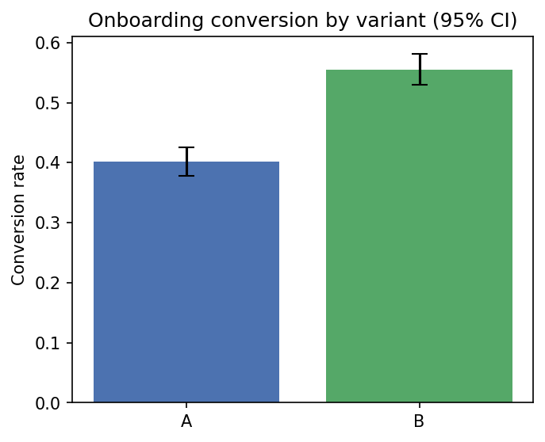
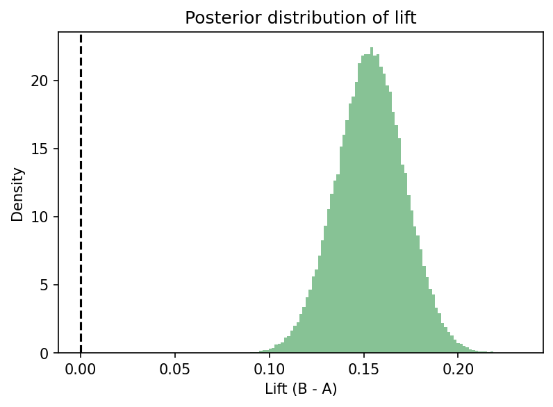

# AB Onboarding Experimentation Platform

End-to-end experimentation stack for A/B testing in a fintech onboarding scenario.  
Built with **FastAPI**, **Postgres**, **dbt**, and analysis scripts in **Python** (frequentist & Bayesian).

---

## Context

We test two flows in user acquisition:

- **Variant A**: traditional onboarding (all steps upfront).  
- **Variant B**: progressive onboarding (stages over time).  

The goal is to measure **conversion to account completion**, while monitoring a compliance guardrail: **KYC completion within 7 days**.

---

## Stack

- **FastAPI** — lightweight API serving variant assignments.  
- **Postgres** — event storage.  
- **dbt** — transforms raw events into staging and analytics marts.  
- **Python scripts** — simulate traffic and analyze results (frequentist & Bayesian).  
- **Docker Compose** — runs Postgres locally.  
- **Makefile** — one-liners for the full workflow.

---

## Quickstart

### Prerequisites
- Docker  
- Python 3.11+ (tested on 3.11 and 3.13)  

### 0) Clone and configure env
```bash
git clone https://github.com/brm-projects/ab-onboarding
cd ab-onboarding

# copy environment template
cp .env.example .env
```

`.env` includes:
- `DATABASE_URL` — SQLAlchemy URL (psycopg v3)
- `API_BASE` — FastAPI base URL
- `DBT_MART_SCHEMA` — schema for dbt marts (`analytics`)
- `EXPERIMENT` — experiment key (`onboarding_progressive_v1`)

### 1) Python env + deps
```bash
make venv
make deps
```

### 2) Start Postgres
```bash
make up
```

### 3) Run the API
```bash
make api   # check http://127.0.0.1:8000/health
```

### 4) Simulate traffic
```bash
make simulate
```

### 5) Build analytics models
```bash
make dbt
make test
```

### 6) Analyze results
Frequentist:
```bash
make analyze
```

Bayesian:
```bash
make analyze-bayes
```

---

## Results

After simulating ~3,000 users:

### Frequentist Analysis

```
[info] Raw counts:
 variant  n_users  n_converted  n_kyc
      A     1556          625    513
      B     1444          802    635

=== Experiment: onboarding_progressive_v1 ===
A: n=1556, conv=625, rate=0.4017, CI95=[0.3776, 0.4262]
B: n=1444, conv=802, rate=0.5554, CI95=[0.5297, 0.5809]

Difference (B - A): 0.1537
z = -8.424, p = 0.000000
Decision: Statistically significant at 5%.

Guardrail (KYC≤7d):
A: rate=0.3297   B: rate=0.4398   Δ(B−A)=+0.1101
KYC guardrail: PASS (non-inferior)

Recommendation: SHIP Variant B
```

Interpretation:  
Variant B shows a clear and statistically significant improvement in onboarding completion. The compliance guardrail also improves, so B can be safely shipped.

---

### Bayesian Analysis (Beta–Binomial)

```
=== Bayesian Results (conjugate Beta–Binomial) ===
Pr(B > A) = 1.000
Lift 95% HDI = [+0.1179, +0.1887]
Pr(|lift| ≤ 0.005) = 0.000  (practical equivalence)

[guardrail] KYC≤7d:
A=0.3297  B=0.4398  Δ(B−A)=+0.1101
KYC guardrail: PASS (non-inferior)

Interpretation:
High posterior probability that B improves conversion (≥ 95%), and KYC guardrail passes.
Recommendation: SHIP Variant B.
```

---

### Visuals

**Conversion Rates with 95% CI**



**Posterior Distribution of Lift (B − A)**



---

### For stakeholders:

- **Conversion rates (bar chart):** Variant B’s bar is much higher than A’s. The error bars are narrow and barely overlap — this means the difference is real, not random noise.  
- **Lift distribution (histogram):** The entire curve is to the right of zero, meaning B almost certainly converts more users than A. The shaded range shows the expected improvement is around +12 to +19 percentage points.  

**Takeaway:** Variant B consistently outperforms A, and compliance (KYC ≤ 7 days) also improves. In a real fintech context, this would justify rolling out Variant B to all users.

